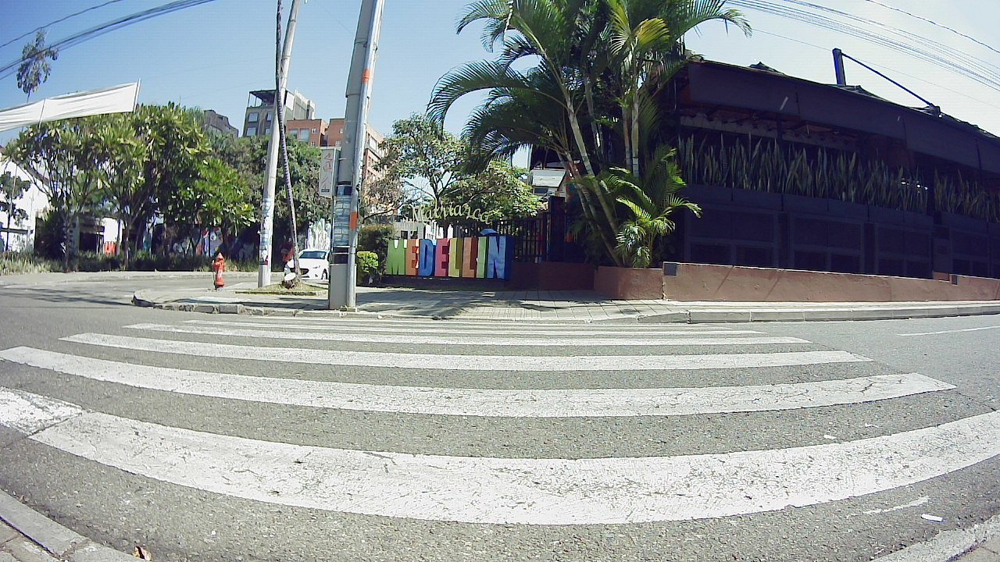
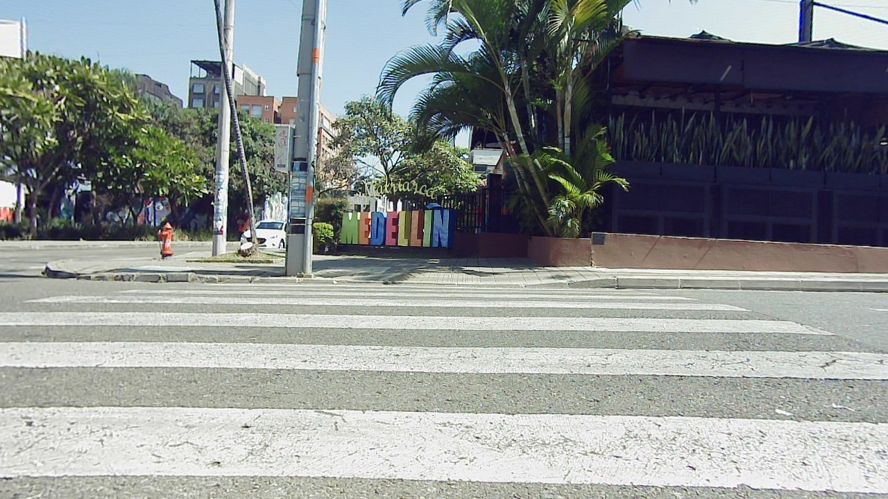

# ROS2 bag to pointcloud
### Pipeline to reconstruct a 3D structure of a scene based on a set of images from a ros2 bag.
<!--  -->
<figure>
  
  <figcaption>Sparse reconstruction + camera path.</figcaption>
</figure>
<!-- <figure>
  
  <figcaption>Mesh reconstruction.</figcaption>
</figure> -->


Mesh reconstruction.

## Overview
Structure from Motion (SfM) is a technique used to reconstruct the 3D structure of a scene from a set of 2D images captured from different viewpoints. COLMAP is a SfM pipeline with command-line interface and features for reconstruction of images collections.\
On the other hand, ROS2 is a very popular robot operating system with features like ros2bags to record data for post processing.

This project consists of 2 stages:
1. **Image processing pipeline:** Here a ros2 bag is processed to extract and structure the needed information for the reconstruction.
2. **COLMAP pipeline:** Here the processed data of the first stage is taken to produce a sparse point cloud with estimated camera poses and optional a dense point cloud of the scene.

## Image processing pipeline
#### Rosbag expected topics and type:
- **Cameras images:** 
    - **msg type:** `sensor_msgs.msg.Image` or `sensor_msgs.msg.CompressedImage`.
    - **Topic name:** Custom name.
- **Cameras info:**
    - **msg type:** `sensor_msgs.msg.CameraInfo`.
    - **Topic name:** Custom name.
- **GPS info:**
    - **msg type:** `sensor_msgs.msg.NavSatFix`.
    - **Topic name:** `/fix`.
- **Transform info:**
    - **msg type:** `tf2_msgs.msg.TFMessage`.
    - **Topic name:** `/tf/odom`, `/tf/base_link`, `/tf/inertial_link`.

#### Masking
Moving objects as pedestrians, cars, etc... lead to failures in the COLMAP pipeline. To mitigate their impact, COLMAP filters regions of the images based on masks, which are created using the Ultralitic's "yolov8x-seg" segmentation model that segments people, cars, motorcicles and trucks. *(Make sure you have an internet connection the first time you use the repository to download the model.)*

*(insert comparisson mask 857 & 246/45 vs filtered image)*\
*(insert matching images)*

#### Output folders

```
colmap_ws/
├── project_name/
│ ├── images/
│ │ ├── camera_1/
│ │ │ ├── camera_1_image_0001.jpg
│ │ │ ├── camera_1_image_0002.jpg
│ │ │ └── ...
│ │ ├── camera_2/
│ │ │ ├── camera_2_image_0001.jpg
│ │ │ ├── camera_2_image_0002.jpg
│ │ │ └── ...
│ │ └── ...
│ ├── masks/
│ │ ├── camera_1/
│ │ │ ├── camera_1_image_0001.jpg.png
│ │ │ ├── camera_1_image_0002.jpg.png
│ │ │ └── ...
│ │ ├── camera_2/
│ │ │ ├── camera_2_image_0001.jpg.png
│ │ │ ├── camera_2_image_0002.jpg.png
│ │ │ └── ...
│ │ └── ...
│ ├── lists/
│ │ ├── camera_1/
│ │ │ ├── cameras.txt
│ │ │ ├── images.txt
│ │ │ ├── points3D.txt
│ │ │ ├── tf_data.txt
│ │ │ ├── gps_data.txt
│ │ │ ├── image_list.txt
│ │ │ ├── image_list_original.txt
│ │ ├── camera_2/
│ │ │ ├── cameras.txt
│ │ │ ├── images.txt
│ │ │ ├── points3D.txt
│ │ │ ├── tf_data.txt
│ │ │ ├── gps_data.txt
│ │ │ ├── image_list.txt
│ │ │ ├── image_list_original.txt
│ │ └── ...

```
#### Output images

<p float="left">
  
   
  <br />
  <em>Distorted image vs Undistorted image</em>
</p>

In this stage all images are undistorted and saved with the next information in their metadata:
- Size: height x width
- Focal length (mm)
- Rosbag recording time (s)
- GPS data: Latitude, longitude & altitude or (x,y) in meters from `/tf` map frame.

<details>
<summary><b>Dataset recording recomendations</b></summary>

- Take the images in an illuminated environment.
- The higher the resolution of the images, the more detailed the reconstruction will be.
- Maintain about 10 meters from camera to objects.
- Take images perpendicular to the object of interest, vanishing points are not good for reconstructions.
- Avoid moving objects.
- Images taken from a single camera must have sufficient visual overlap (>60%).
- If recorded with multiple cameras, cameras must have sufficient visual overlap (>60%).
- If possible, close the recording path cycle.
- Rotations on the same axis are not desirable.
- Maintain a constant robot speed.
- Manage robot speed and recording frequency to ensure data (Images, tf & GPS) synchronisation and overlapping of images.
- Single line recording path is not desirable for georeferencing.
- Get accurate intrinsics and extrinsics.

</details>

#### Usage Instructions
To use this pipeline, first set the configuration file [config_dataset.yaml](main_folder/config_dataset.yaml) specifying all the needed parameters and then run [dataset_generator.py](main_folder/dataset_generator.py).

## COLMAP pipeline
This pipeline was designed to automate the command line flow and deliver a reconstruction using the information from the first stage. [COLMAP](https://colmap.github.io/) is a very extensive tool with many functionalities and parameters. This pipeline incorporates some of its main functionalities, allowing multi-camera reconstructions from known and unknown camera poses, different matchers and model scalators.

#### Output folders

```
colmap_ws/
├── project_name/
│ ├── images/
│ │ └── ...
│ ├── masks/
│ │ └── ...
│ ├── lists/
│ │ └── ...
│ ├── SfM/
│ │ ├── sparse/
│ │ │ ├── sparseModel.ply
│ │ │ ├── final_model_poses/
│ │ │ │ ├── cameras.txt
│ │ │ │ ├── images.txt
│ │ │ │ ├── points3D.txt
│ │ │ └── ...
│ │ ├── dense/
│ │ │ ├── denseModel.ply
│ │ │ ├── meshed-delaunayModel.ply
│ │ │ ├── meshed-poissonModel.ply
│ │ │ └── ...
│ │ ├── database.db

```
<details>
<summary>Sparse pointcloud generation pipeline (/tf)</summary>\

Initial pose of cameras given by (/tf).
1. Feature extraction
2. Feature matcher
3. image_list.txt reading
4. Point triangulation & bundle adjustment cycle
5. Model scaling
6. Sparse model (PLY generation)
7. Cameras pose extraction

</details>

<details>
<summary>Sparse pointcloud generation pipeline (GPS)</summary>\

Triangulated cameras pose.
1. Feature extraction
2. Feature matcher
3. image_list.txt reading
4. Mapper
5. Model Geo-registration/scaling
6. Sparse model (PLY) generation
7. Cameras pose extraction

</details>

<details>
<summary>Dense pointcloud generation pipeline</summary>\

1. Image undistorter
2. Patch match stereo
3. Stereo fusion
4. Poisson mesher / Delaunay mesher

</details>

#### Usage Instructions
To use this pipeline, first set the configuration file [config_colmap.yaml](main_folder/config_colmap.yaml) specifying all the needed parameters and then run [colmap_pipeline.py](main_folder/colmap_pipeline.py).

## Requirements

<details>
<summary> <b>Docker</b> </summary>

```
sudo apt update
sudo apt-get install ca-certificates curl gnupg
sudo install -m 0755 -d /etc/apt/keyrings
curl -fsSL https://download.docker.com/linux/ubuntu/gpg | sudo gpg --dearmor -o /etc/apt/keyrings/docker.gpg
sudo chmod a+r /etc/apt/keyrings/docker.gpg
echo \
  "deb [arch=$(dpkg --print-architecture) signed-by=/etc/apt/keyrings/docker.gpg] https://download.docker.com/linux/ubuntu \
  $(. /etc/os-release && echo "$VERSION_CODENAME") stable" | \
  sudo tee /etc/apt/sources.list.d/docker.list > /dev/null

sudo apt-get update
sudo apt-get install docker-ce docker-ce-cli containerd.io docker-buildx-plugin docker-compose-plugin
```

</details>

<details>
<summary> <b>Nvidia driver</b> </summary>
Make sure to have the nvidia driver for GPU and check with:
```
nvidia-smi
```

</details>

<details>
<summary> <b>Cuda toolkit</b> </summary>

```
wget https://developer.download.nvidia.com/compute/cuda/repos/ubuntu2204/x86_64/cuda-ubuntu2204.pin
sudo mv cuda-ubuntu2204.pin /etc/apt/preferences.d/cuda-repository-pin-600
wget https://developer.download.nvidia.com/compute/cuda/12.4.1/local_installers/cuda-repo-ubuntu2204-12-4-local_12.4.1-550.54.15-1_amd64.deb
sudo dpkg -i cuda-repo-ubuntu2204-12-4-local_12.4.1-550.54.15-1_amd64.deb
sudo cp /var/cuda-repo-ubuntu2204-12-4-local/cuda-*-keyring.gpg /usr/share/keyrings/
sudo apt-get update
sudo apt-get -y install cuda-toolkit-12-4

# Add to .bashrc
export PATH=/usr/local/cuda-12.4/bin${PATH:+:${PATH}}
export LD_LIBRARY_PATH=/usr/local/cuda-12.4/lib64${LD_LIBRARY_PATH:+:${LD_LIBRARY_PATH}}
# verify: nvcc --version
```

</details>

<details>
<summary> <b>Nvidia-docker toolkit</b> </summary>

```
curl -fsSL https://nvidia.github.io/libnvidia-container/gpgkey | sudo gpg --dearmor -o /usr/share/keyrings/nvidia-container-toolkit-keyring.gpg \
  && curl -s -L https://nvidia.github.io/libnvidia-container/stable/deb/nvidia-container-toolkit.list | \
    sed 's#deb https://#deb [signed-by=/usr/share/keyrings/nvidia-container-toolkit-keyring.gpg] https://#g' | \
    sudo tee /etc/apt/sources.list.d/nvidia-container-toolkit.list
sudo apt-get update
sudo apt-get install -y nvidia-container-toolkit
sudo systemctl restart docker
```

</details>

## Run project
Build the docker file:
```
docker build -t="colmap:cuda" .
```
Run the image:

Ros2 + Colmap CLI
```
docker run \
    --gpus all \
    -w /working \
    -v /route/to/.../rosbag2pointcloud:/working \
    -it colmap:cuda
```
Ros2 + Colmap GUI
```
docker run \
    -e QT_XCB_GL_INTEGRATION=xcb_egl \
    -e DISPLAY=$DISPLAY \
    -v /tmp/.X11-unix:/tmp/.X11-unix \
    -w /working \
    -v /route/to/.../rosbag2pointcloud:/working \
    --gpus all \
    --privileged \
    -it colmap:cuda \
    - colmap gui
```
<details>
<summary> GUI Troubleshooting </summary>

```
xhost +
```

</details>

## Conclusions
Section still in process
reconstructions: (Add results page with real dataset and simulated dataset)
errores en las mascaras

## Future work
Section still in process
Use the reconstruction and images to train a model for autonomous navigation.
Explore alternatives for densification and voxelization
Add images to an existing sparse model

## Contact Me
https://www.linkedin.com/in/dasv1298/

